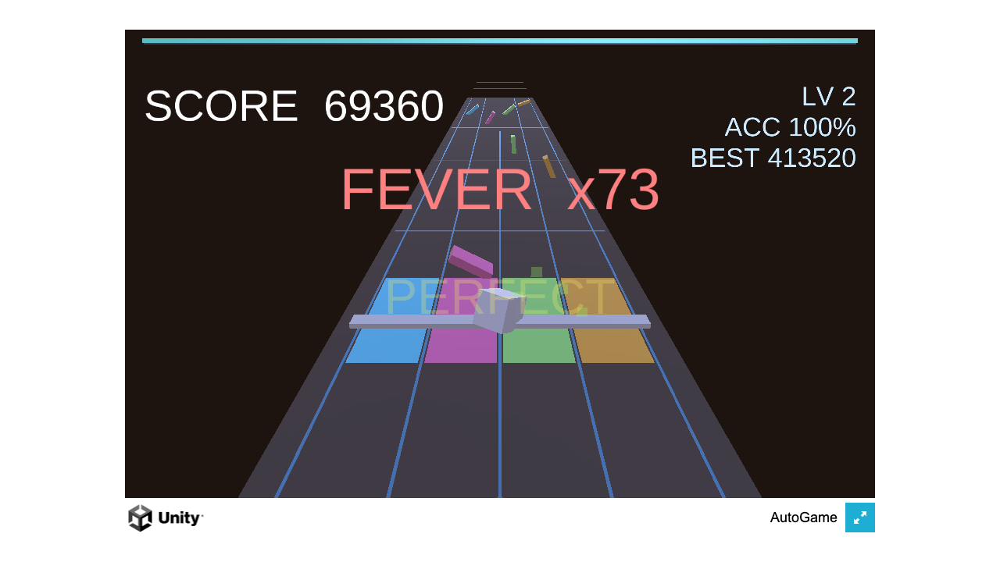

# PULSE LANES

A 3D rhythm-tap arcade game: strike glowing notes streaming down a 4-lane neon highway on the beat — PERFECT/GOOD timing, combo multipliers, FEVER mode, and melodic hit-tones that climb a pentatonic scale as your streak grows.

**▶ Play in browser:** https://masafykun.github.io/pulse-lanes/

## About
A small game built with Unity (6000.0.77f1). The C# source is under `src/`.
This repository also hosts a WebGL build, playable directly in the browser via GitHub Pages.
